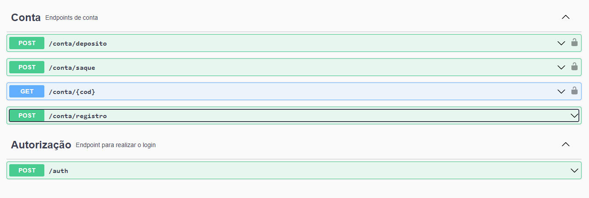

# Desafio técnico XP Inc Back End

Boas vindas ao meu desafio técnico back-end da XP. A aplicação é uma API do mercado de ações com algumas funcionalidades de conta digital. Ela alimenta o front-end com informações dos ativos disponíveis, além de conter endpoints para compra e venda de ações e saque e depósito na conta do cliente. 

Aqui você vai encontrar o passo a passo de como rodar o projeto além de alguns detalhes sobre os desafios que eu enfrentei para desenvolver a aplicação! 🚀

# Orientações

<details>
  <summary><strong>‼️ Rodando a aplicação</strong></summary><br />

  1. Clone o repositório

  - `git clone https://github.com/joaogrs/desafioXPIncBackend.git`.
  - Entre na pasta do repositório que você acabou de clonar:
    - `cd desafioXPIncBackend`

  2. Instale as dependências

  - `npm install`

  3. Crie um arquivo .env na raiz do projeto
    - Ele deve conter as seguintes informações: 
      - MYSQL_HOST= ( O seu host )
      - MYSQL_USER= (Seu usuário do MYSQL)
      - MYSQL_PASSWORD= (Sua senha do MYSQL)
      - MYSQL_DATABASE= InvestimentManager
      - PORT= (Em qual porta a aplicação vai rodar)
     
  4. Faça a criação do banco dentro do MYSql
  - Na raiz do projeto existe um arquivo InvestimentManager.Sql
  - As querys são as mesmas da sessão Tabelas desse README
    - Essas são as querys necessárias para a criação do banco de dados da aplicação
    - Copie as informações e rode dentro de um servidor SQL. 
  
  5. Rodando a aplicação
  - `npm start`
  
</details>

<details>
  <summary><strong>🪑 Tabelas</strong></summary><br />
  
  O banco tem 7 tabelas. clientes, compras, vendas, investimentos, his_deposito, hist_saque, ativos_disponiveis
  
  ```sql
DROP DATABASE IF EXISTS InvestimentManager;

CREATE DATABASE InvestimentManager;

USE InvestimentManager;

CREATE TABLE clientes (
    codCliente INT NOT NULL auto_increment,
    saldo DECIMAL(8,2) NOT NULL,
    username VARCHAR(30) NOT NULL,
    password VARCHAR(80) NOT NULL,
    PRIMARY KEY(codCliente)
) ENGINE=INNODB;

CREATE TABLE ativos_disponiveis (
    id INT NOT NULL auto_increment,
    nome VARCHAR(30) NOT NULL,
    qtdeAtivo INT NOT NULL,
    valor DECIMAL(8,2) NOT NULL,
    PRIMARY KEY(id)
) ENGINE=INNODB;

CREATE TABLE compras (
    id INT NOT NULL auto_increment,
    codCliente INT NOT NULL,
    codAtivo INT NOT NULL,
    qtdeAtivo INT NOT NULL,
	PRIMARY KEY(id),
    FOREIGN KEY (codCliente)
        REFERENCES clientes (codCliente)
        ON DELETE CASCADE,
    FOREIGN KEY (codAtivo)
        REFERENCES ativos_disponiveis (id)
        ON DELETE CASCADE
)  ENGINE=INNODB;

CREATE TABLE vendas (
    id INT NOT NULL auto_increment,
    CodCliente INT NOT NULL,
    CodAtivo INT NOT NULL,
	QtdeAtivo INT NOT NULL,
	PRIMARY KEY(id),
    FOREIGN KEY (CodCliente)
        REFERENCES clientes (codCliente)
        ON DELETE CASCADE,
    FOREIGN KEY (CodAtivo)
        REFERENCES ativos_disponiveis (id)
        ON DELETE CASCADE
)  ENGINE=INNODB;

CREATE TABLE investimentos (
    id INT NOT NULL auto_increment,
    CodCliente INT NOT NULL,
    CodAtivo INT NOT NULL,
	QtdeAtivo INT NOT NULL,
    Valor DECIMAL(8,2) NOT NULL,
    PRIMARY KEY(id),
    FOREIGN KEY (CodCliente)
        REFERENCES clientes (codCliente)
        ON DELETE CASCADE,
    FOREIGN KEY (CodAtivo)
        REFERENCES ativos_disponiveis (id)
        ON DELETE CASCADE
)  ENGINE=INNODB;

CREATE TABLE hist_deposito (
    id INT NOT NULL auto_increment,
    CodCliente INT NOT NULL,
    Valor DECIMAL(8,2) NOT NULL,
    PRIMARY KEY(id),
    FOREIGN KEY (CodCliente)
        REFERENCES clientes (codCliente)
        ON DELETE CASCADE
)  ENGINE=INNODB;

CREATE TABLE hist_saque (
    id INT NOT NULL auto_increment,
    CodCliente INT NOT NULL,
    Valor DECIMAL(8,2) NOT NULL,
    PRIMARY KEY(id),
    FOREIGN KEY (CodCliente)
        REFERENCES clientes (codCliente)
        ON DELETE CASCADE
)  ENGINE=INNODB;

SET SQL_SAFE_UPDATES = 0;

INSERT INTO InvestimentManager.ativos_disponiveis (nome, qtdeAtivo, valor) VALUES
    ("XPIN", 1340985, 16.94),
    ("XPED", 50430, 5.75),
    ("RICO", 1203945, 9.60),
    ("TRYB", 13407, 10.39),
    ("GOOG", 50430948, 40.84),
    ("MTP4", 1203945, 23.93),
    ("SEF3", 103244, 3.40),
    ("META", 132394, 50.98),
    ("PTR4", 102938495, 28.60),
    ("ITU4", 3294329, 22.85),
    ("UNM3", 312432, 14.57),
    ("PATX", 10, 3.1),
    ("VSPO", 0, 10);

INSERT INTO InvestimentManager.clientes(codCliente, saldo, username, password) VALUES
    (1, 2000, "joaogrs", "senha1234");

INSERT INTO InvestimentManager.investimentos(CodCliente, CodAtivo, QtdeAtivo, Valor) VALUES
    (1, 2, 3, 17.25),
    (1, 4, 7, 72.73),
    (1, 7, 1, 3.4),
    (1, 10, 3, 68.55);
```
</details>

<details>
  <summary><strong>📁 Documentação e Rotas Disponíveis</strong></summary><br />
  
  A documentação contendo todas as rotas e a estrutura do banco foi feita com a utilização do Swagger.

  
  
  
  Na raiz do projeto também contém uma pasta imgs com um print de todas as rotas. 
  
  1. Rode a aplicação
    - `npm start`
  
  2. Entre na rota do Swagger UI
    - `/docs`
</details>

<details>
  <summary><strong>🔒 Autenticação JWT</strong></summary><br />

  Grande parte das rotas necessitam de uma verificação JWT. É possível ver quais são nas imagens da sessão de Swagger (Contém o cadeado ao lado da rota).

  1. Entre na rota de autenticação
    - `/auth`

  2. Coloque um usuário válido no body
    - `{ "username": "joaogrs", "password: senha123" }`

  3. Copie o token retornado e use-o como a authorization das rotas
</details>

# Sobre o Desenvolvimento e Desafios Enfrentados

<details>
  <summary><strong>🛠 Desafios enfrentados</strong></summary><br />
  
  O primeiro desafio que encontrei na realização do case foi a decisão de quais técnologias usar. Decidi por utilizar express com javascript sem o uso de ORM. Foi uma  decisão tomada pensando em priorizar as funcionalidades da API ao invés de adicionar uma complexidade no código que poderia atrasar o desenvolvimento da aplicação e dos requisitos bônus que eu também queria realizar. 

Após isso, pensar a estrutura do banco de dados também foi um processo desafiador. O primeiro passo foi construir um diagrama de entidade relacionamento a mão para entender quais eram os campos necessários e como as tabelas iam conversar entre si. A maior dificuldade aqui foi entender como o post de compras e vendas iam alterar as tabelas. A solução dada foi criar tabelas de histórico de compra e venda, onde o post insere os dados, e uma terceira tabela de carteira de investimentos, onde ficam as quantidades e valor total de investimentos de cada cliente. Caso seja a primeira vez que um cliente está comprando determinado ativo é feita uma inserção na carteira. Caso ele já possua o ativo, é atualizada a quantidade e o valor total ao comprar ou vender um ativo. A estrutura de saque e depósito é parecida, porém alterando o saldo em uma tabela de clientes.

Passado esse momento de decisões e já com o formato do projeto em mente iniciei sua estrutura. Para o desenvolvimento usei o eslint para a qualidade do código e o nodemon para ir rodando a api enquanto desenvolvia. Além disso, o projeto foi feito utilizando a arquitetura MSC, separando a API em camadas com funcionalidades distintas.

A partir daí o desenvolvimento correu de forma mais tranquila já que eu tinha bastante familiaridade com a estrutura e tecnologias que eu estava usando. Algumas lógicas que me marcaram nessa etapa de desenvolvimento foram as que alteram o saldo e a qtde dos ativos na carteira ao realizar os posts. Terminei os requisitos obrigatórios com cerca de 3 dias de projeto e já comecei a pensar quais seriam os próximos passos.

Depois disso, optei por realizar o máximo de validações possíveis (campos faltantes, valores negativos, tipos errados, etc) utilizando middlewares. Apesar de ter um bom conhecimento na lib joi, que testa os campos automaticamente, preferi fazer as validações a mão já que eram relativamente simples.

Com as validações feitas, comecei a implementação do JWT com uma rota extra de login (usuário, senha) onde é retornado o token. Após isso, foi só adicionar um middleware de validação de token nas rotas que eram necessárias. Nesse mesmo dia foram preenchidos os ativos disponiveis para o front, além de uma rota GET que retorna tais ativos.

Em seguida foi dado inicio aos testes unitários divididos por camada MSC, a implementação do Swagger além da criação desse README.
</details>

<details>
  <summary><strong>⚙️ Tecnologias utilizadas</strong></summary><br />
  
  - Javascript
  - NodeJs
  - Express
  - JWT
  - Swagger
  - Sinon
  - Mocha 
  - Chai
  - Eslint
  - MySql
  
</details>

Qualquer dúvida é só entrar em contato comigo pelo email <a>jgabrielrodrigues15@gmail.com</a>! ;)